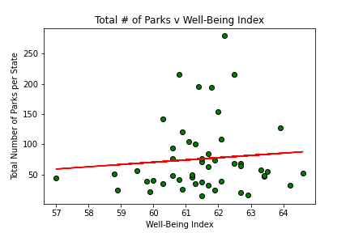
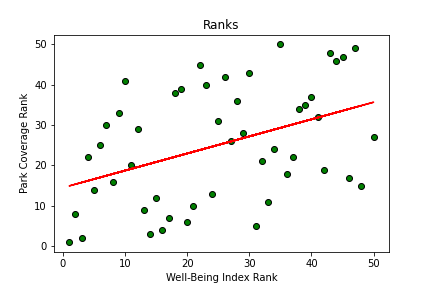

# Project 1, Group 4: What Makes People Happy?

Team Members: Alexandra Pfleegor, Ken Condit, Eric Zhu, Myles Browne, Drew Blankenbiller, Chuck McManus

## Background
What makes people happy? 

Is it Family Structure? Tennis? Weather? Marriage? Crime? The Housing Market? Access to Parks? 

Our group decided to dig deeper into Gallup's 2018 Well-Being Poll of Americans by State. 

# Table of Contents 
* Data Sources
* Data Cleaning and Exploration
* Tennis
* Housing Costs & Weather
* Crime
* Family Structure
* Number of Parks

# Data Sources 
* 2018 Gallup Poll Well-Being Index
* Historical Climate Data from the National Centers for Enivronmental Information
* Housing Data from Realtor.com for 2018
* 2018 American Community Survey from the US Census Bureau

# Data Cleaning and Exploration 

## Tennis Anyone? 

## Housing Costs & Weather?

Overall, our group concluded that housing costs and weather have some correlation with the happiness index. Specifically, the amount of annual precipitation has an inverse impact on the happiness index: the less it rains, the happier people are. The amount that people have to spend on housing per month is surprisingly positively correlated with happiness. This means that states where people have to spend more on housing per month tend to have higher levels of happiness. There is most likely some confounding factor that should be further researched in this relationship.

## Crime?

## Family Structure?

## # of Parks?

## Setbacks

